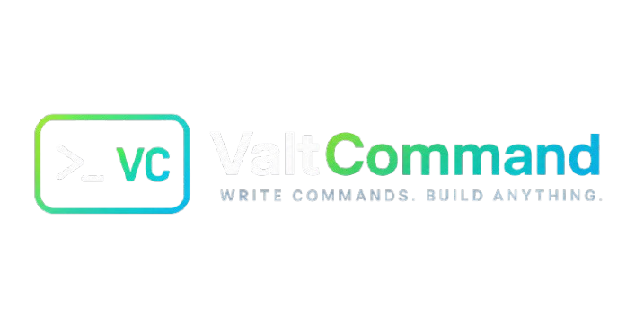

<div align="center">



# ValtCommand

**A lightweight command-based interpreted language.**

[](https://isocpp.org/)
[](https://cmake.org/)


[](./DOCs/Roadmap.md)
[](./LICENCE)

</div>

# Overview

ValtCommand is a lightweight command-based interpreted language designed
for applications that need a simple, typed, and extensible scripting system.

The language focuses on:

- Simplicity
- Readability
- Type safety
- Easy C++ integration
- Fast execution

---

# Features

- Function-based execution model
- Strongly typed arguments
- Extensible function registry
- Human-readable syntax
- Lightweight runtime
- Easy embedding into existing C++ applications

---

# Example

```txt
CALL print
    text<str>:"Hello World"

CALL open_chart
    symbol<str>:"BTCUSDT"
    timeframe<str>:"1h"
```

---

# Architecture

```text
Source File
     │
     ▼
Lexer
     │
     ▼
Tokens
     │
     ▼
Parser
     │
     ▼
AST
     │
     ▼
Runtime
     │
     ▼
Function Registry
     │
     ▼
Application
```

---

# Project Status

ValtCommand is currently under active development.

The language specification evolves through versioned documents.

---

# Project Documents

| Document | Link |
|----------|----------|
| Roadmap | [Roadmap.md](./DOCs/Roadmap.md) |
| License | [LICENSE](./LICENCE) |
| Version Specifications | [Folder](./DOCs/Versions/) |

---

---

# Specifications

| Version | Status | Description |
|----------|----------|----------|
| v0.1 | In Development | Core language, lexer, parser, runtime |
| v0.2 | Planned | Diagnostics and language improvements |
| v0.3 | Planned | Valtrida integration |
| v0.4 | Planned | Script engine enhancements |
| v0.5 | Planned | Automation system |
| v1.0 | Future | Stable public release |

---

# Version Documents

Detailed specifications are maintained separately.

| Version | Document | Wiki |
|----------|----------|-----------|
| v0.1 | [v0.1.md](./DOCs/Versions/V0.1.md) | [V0.1]() |

---

# Roadmap

## v0.1

- Lexer
- Parser
- AST
- Runtime
- Function Registry
- Type Validation
- Error Handling

## Future

- Diagnostics
- Additional Types
- Workspace Integration
- Automation Features
- Runtime Extensions

---

# License

This project is currently under development.

License information will be published before the first stable release.