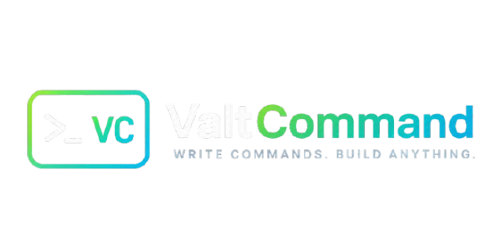

<div align="center">



# ValtCommand

**A lightweight command-based interpreted language.**

[](https://isocpp.org/)
[](https://cmake.org/)


[](./DOCs/Roadmap.md)
[](./LICENCE)

</div>

# Overview

ValtCommand is a lightweight command-based interpreted language designed
for applications that need a simple, typed, and extensible scripting system.

The language focuses on:

- Simplicity
- Readability
- Type safety
- Easy C++ integration
- Fast execution

---

# Features

- Function-based execution model
- Strongly typed arguments
- Extensible function registry
- Human-readable syntax
- Lightweight runtime
- Easy embedding into existing C++ applications

---

# Example

```txt
// set varable of type integer
SET var<int> = 10

// call print function
CALL print 
     value<int>:(GET var)+10
END

// call print function again
CALL print 
     value<str>:"Hellow, i am from ValtCommand :D"
END
```

# Version Documents

Detailed specifications are maintained separately.

| Version | Document | Wiki |
|----------|----------|-----------|
| v0.1 | [v0.1.md](./DOCs/Versions/V0.1.md) | [V0.1]() |
| v0.1 | [v0.2.md](./DOCs/Versions/V0.2.md) | [V0.2]() |

---

# Project Status

ValtCommand is currently under active development.

The language specification evolves through versioned documents.

---

# Project Documents

| Document | Link |
|----------|----------|
| Roadmap | [Roadmap.md](./DOCs/Roadmap.md) |
| License | [LICENSE](./LICENCE) |
| Version Specifications | [Folder](./DOCs/Versions/) |
| Some Exemples | [Folder](./DOCs/Examples/) |